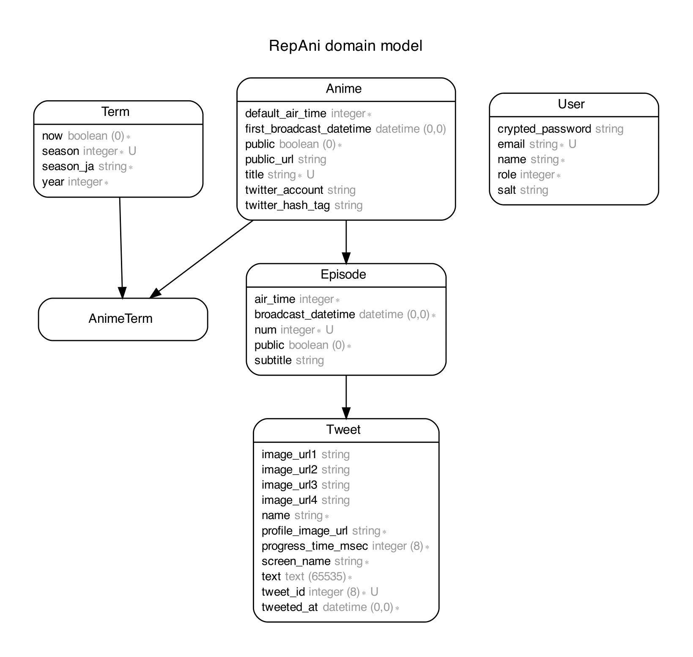
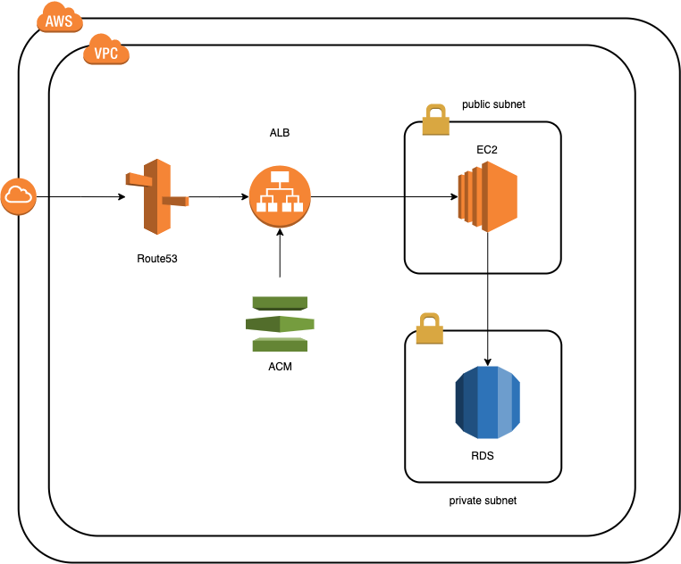

# リプアニ

## サービス概要
一人でアニメを見るのが寂しい、またはネット上の反応を見ながらアニメを楽しみたいという方に  
アニメ放送時のTwitterの実況の模様をお届けする、  
Twitterでのアニメ実況再現アプリ『リプアニ』です。

## 登場人物
### エンドユーザー
- Twitterの実況を見ながらアニメを楽しみたいユーザー
### 管理者
- ユーザー情報を管理する人

## 課題
- 一人でアニメを見ていて寂しくなる
- ネットでの反応もあわせてアニメを楽しみたい

## 解決方法
当時の該当アニメのTwitter実況の様子を画面上に表示するようにします。  
ユーザーは、本アプリを見ながらアニメを見ることで、よりアニメを楽しむことができます。  

## プロダクト
Twitterのアニメ実況再現アプリ

## マーケット
- アニメをリアタイできなかった人
- Twitterでの実況を見ながらアニメを楽しみたい人

## テーブル設計

## インフラ構成図

